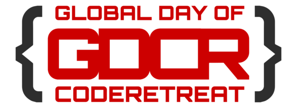

:title: GDCR @ Pivotal Labs
:skip-help: true
:data-transition-duration: 1500
:css: gdcr_2015_pivotal_labs.css

Prepare docker image for presentation by executing::

    docker build --tag gdcr_at_pivotal:latest .

You can render this presentation to HTML with the command::

    docker run -d -p 8000:8000 gdcr_at_pivotal

Presentation is available under your local address::

    http://localhost:8000

We need::

    Flipcharts for 4 rules x2 , Conway's game of life rules x2

Don't forget about::

    WIFI credentials

    Twitter hashtag

TO DO ON DAY:

    PLUGINS

    PRINT RULES AND PLACE ON THE WALL

    ARRANGE CAMERA

GISTS:
    Rules: http://git.io/v8jly
    Activities:

----

@
=

.. note::

    Start!!!

----

Why are we here today
=====================

* Learn

* Practice

* Experiment

* Get out of our comfort zone

.. note::

    * New Language

    * TDD, BDD or any other technique.

    * Tools

    * Share Knowledge

    * Expose to new ideas

----

Coderetreat is ...
==================

    * One day event

    * Practice fundamentals

    * 6 sessions

    * Different pair for each session

    * One constraint in each session

.. note::

    TDD, BDD, OO, functional paradigm, clean code.
    You define what is important for you.

----

:data-y: r1000

Structure of the day
====================

    * 15 minutes intro
    * 3 sessions of 45min
    * 15min retro after each session
    * 1 hour lunch
    * 3 sessions of 45min
    * 15min retro after each session
    * 15 minutes closing circle

----

HOWTO
=====

    * Choose your pair

    * Choose your language

    * Focus on practice

    * We don't have to finish

    * DELETE YOUR CODE

    * Be respectful

.. note::

    How you solved problem is not so important as the lesson you learnt

----

4 rules of good design
======================

    * Tests Pass

    * Express Intent

    * No Duplication

    * Small

.. note::

    * Passes all the tests.

    * Express every idea we need to express.

    * Contains no duplication. DRY

    * Minimized the number of classes, methods and other moving parts.

----

:id: gameOfLife

Conway's Game of Life
=====================

    * A **live cell** having less than 2 live neighbors *dies*

    * A **live cell** having 2 or 3 live neighbors **lives**

    * A **live cell** having more than 3 neighbors *dies*

    * A *dead* cell having 3 neighbors becomes **alive**

.. note::

    http://git.io/v8jly

    The universe of the Game of Life is an infinite two-dimensional orthogonal grid of square cells,
    each of which is in one of two possible states, live or dead.

    Every cell interacts with its eight neighbors, which are the cells that are directly horizontally, vertically, or diagonally adjacent.

----

:id: haveFun
:data-rotate: 90

HAVE FUN
========

----

:data-x: r0
:data-y: r500
:data-scale: 0.1
:id: sessionOne

Session One
===========

----

:id: sessionOneDescription

Session One
===========

Learn your domain
=================

    * Get familiar with domain problem

    * Navigator-driver

    * Remember to DELETE THE CODE

.. note::
    Navigator-driver
    Pair programming consists of two programmers sharing a single workstation (one screen, keyboard and mouse among the pair).
    The programmer at the keyboard is usually called the "driver", the other, also actively involved in the programming
    task but focusing more on overall direction is the "navigator";
    it is expected that the programmers swap roles every few minutes or so.

----

:id: retroOne

Retro One
=========

----

:id: sessionTwo

Session Two
===========

----

Session Two
===========

Basics
======

    * Ping-pong

    * EVIL ping-pong

    * Mute pairing

    * No mouse

    * Paper for the first 10 minutes

.. note::

    Ping-pong - one person writes the tests, the other person writes the implementation code. Add EVIL

----

:id: retroTwo

Retro Two
=========

----

:id: sessionThree

Session Three
=============

----

Session Three
=============

Out of the comfort zone
=======================

    * Immutables only, please

    * No conditional statements

    * No naked primitives

    * No loops

    * Only 4 lines per method

----

:id: retroThree

Retro Three
===========

----

:id: lunch

Lunch
=====

----

:id: sessionFour

Session Four
============

----

Session Four
============

Practice
========

    * TDD as if you meant it

    * Object calisthenics

    * NO TDD!!!

.. note::

    * TDD as if you meant it

    * Object calisthenics

    http://williamdurand.fr/2013/06/03/object-calisthenics/

    9 rules:
    -- Only One Level Of Indentation Per Method
    -- Don't Use The ELSE Keyword
    -- Wrap All Primitives And Strings
    -- First Class Collections
    -- One Dot Per Line
    -- Don't Abbreviate
    -- Keep All Entities Small
    -- No Classes With More Than Two Instance Variables
    -- No Getters/Setters/Properties

----

:id: retroFour

Retro Four
==========

----

:id: sessionFive

Session Five
============

----

Session Five
============

Let's play
==========

    * Mute with Find the Loophole

    * Code Swap

    * Hexagonal Game of Life (H:B2/S34)

.. note::

    * Mute with Find the Loophole

    This is a pairing exercise. It is actually three pairing techniques brought together in one exercise.

    -- Ping-pong - one person writes the tests, the other person writes the implementation code
    -- Mute - nobody can talk
    -- Evil coder  - the implementation person purposely writes the wrong algorithm that still makes the tests turn green.
    The key is that they have to keep the code very clean all the while. So, no big long if statements parsing on the input parameters.

    * Code swap

    Each developer starts at their machine and is given 20 minutes to solve the kata.
    At the end of twenty minutes someone calls time and everyone gets up from their machine and rotates to the next workstation.

----

:id: retroFive

Retro Five
==========

----

:id: sessionSix

Session Six
===========

----

SessionSix
==========

Choose what you want to do
--------------------------

----

:id: retroSix

Retro Six
=========

----

:id: closingCircle

Closing Circle
==============
